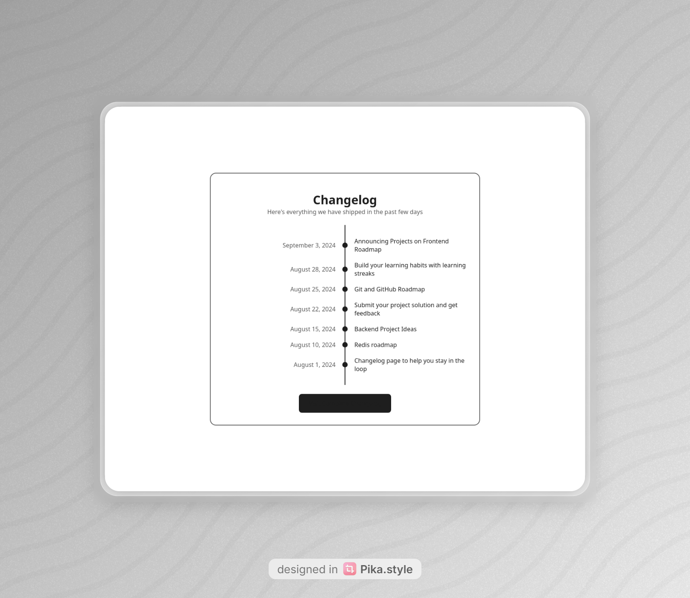

# Changelog Component

A simple, responsive changelog UI component built with **vanilla HTML and CSS**.



This project is part of a series of small projects from [roadmap.sh](https://roadmap.sh/) that I'm building to practice and reinforce the fundamentals of HTML, CSS, and JavaScript — no frameworks, no build tools.

- **Live demo:** https://changelog-component-demo-mater.vercel.app
- **Project page on roadmap.sh:** https://roadmap.sh/projects/changelog-component

## About the project

The goal of the original [roadmap.sh challenge](https://roadmap.sh/projects/changelog-component) is to practice **positioning and layout in CSS** by building a small component for a website that displays a changelog — a log of notable changes or updates to a project.

The focus is on:

- A clean, well-structured HTML markup.
- A responsive layout using modern CSS (CSS Grid, custom properties, `clamp()`).
- WCAG 2.1 AA compliant color contrast.
- No JavaScript dependencies, no frameworks — just the platform.

## Features

- Vertical timeline with a continuous line and date/description rows.
- Fully responsive — the timeline stays connected at every viewport width.
- CSS reset and centered card layout.
- Accessible color palette (text and UI elements meet WCAG 2.1 AA, most reach AAA).
- Uses modern CSS features like `contrast-color()` for the button.

## Tech stack

- HTML5
- CSS3 (Grid, custom properties, `clamp()`, `contrast-color()`)

## Run locally

Just open `index.html` in any modern browser — no build step required.

```bash
git clone https://github.com/Matysiak-Mateusz/changelog-component.git
cd changelog-component
start index.html
```

## License

MIT
